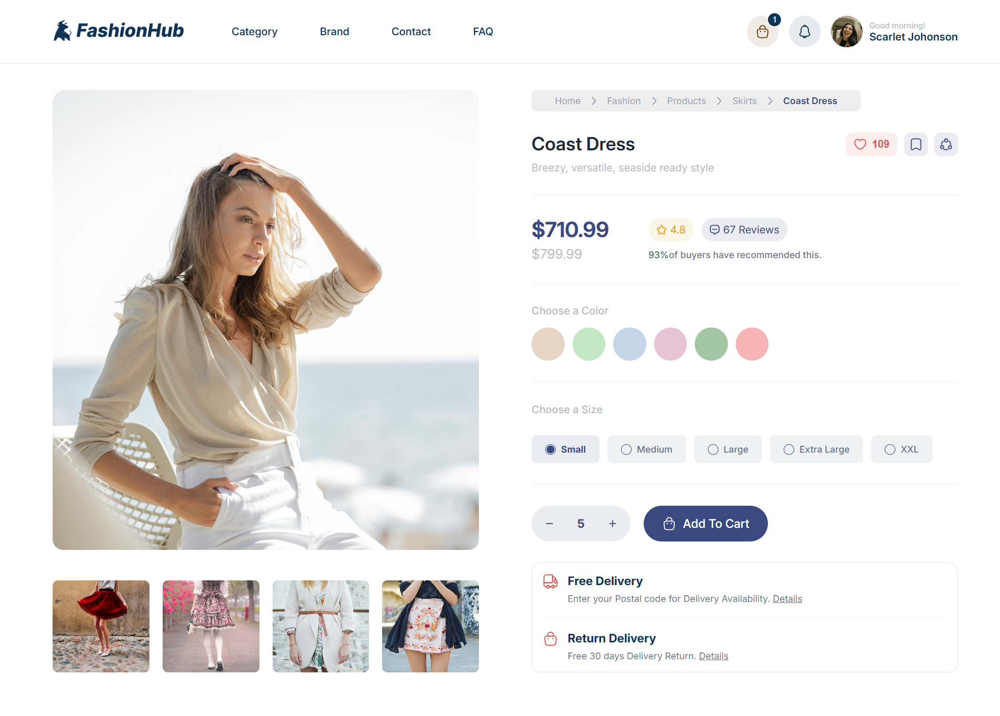

# 🚀 Midterm Web Project - Yasna BagherNezhad

Welcome to my midterm project repository! This project is developed as part of the Web Design course.
This is a simple and clean page for a fashion store called **FashionHub**. It shows a beautiful dress and lets you choose your favorite color and size.

## 📌 Project Overview
 
FashionHub is a modern and clean product page for a clothing brand. This project focuses on the "Coast Dress" and shows how a customer can see product details, pick a color, and choose a size in a simple and beautiful way.

## 🛠 Technologies Used
- **HTML5**
- **CSS3** 
- **Git & GitHub** for version control

## 📂 Project Structure
- `/css`: Contains all stylesheets.
- `/assets`: Project icons and images.
- `/fonts`: Custom fonts used in the project.
- `index.html`: The main entry point.

### What is in this site?
- **Product Details:** See photos and prices of the Coast Dress.
- **Easy Choice:** You can pick different colors and sizes.
- **Clean Design:** A white and modern look for a better shopping experience.
- **Shipping Info:** Information about free delivery and how to return the product.

